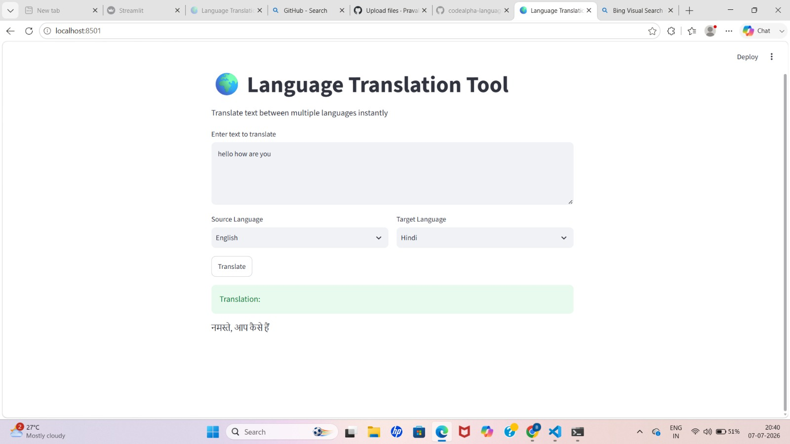

# CodeAlpha Task 1: Language Translation Tool

## 📌 Description
A web application that translates text between 100+ languages using Python, Streamlit, and Google Translator.

## ✨ Features
- Translate text between multiple languages
- Auto-detect source language
- Copy translated text to clipboard
- Play audio of translated text using gTTS

## 🛠️ Tech Stack
- Python
- Streamlit
- deep-translator
- gTTS
- pyperclip

## 🚀 How to Run
1. Clone the repository
2. Install dependencies:
```bash
pip install -r requirements.txt
## Screenshot

